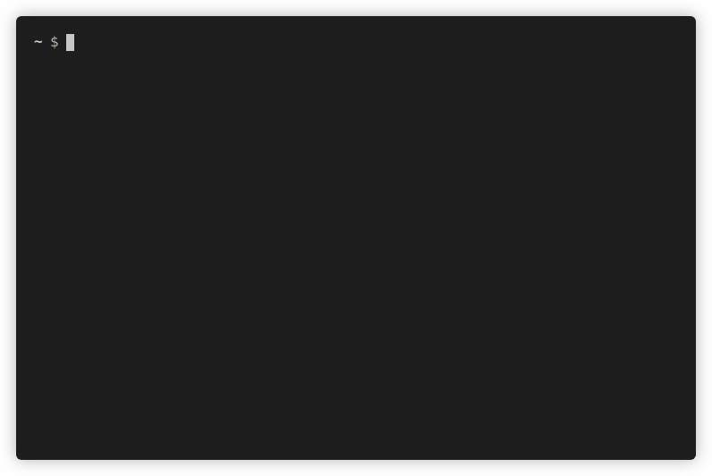

# spid-sp-test


[](https://pepy.tech/project/spid-sp-test)
[](https://pepy.tech/project/spid-sp-test)

spid-sp-test is a SAML2 SPID/CIE Service Provider validation tool that can be executed from the command line.
This tool was born by separating the test library already present in [spid-saml-check](https://github.com/italia/spid-saml-check).

## Summary

* [Features](#features)
* [Setup](#setup)
* [Overview](#overview)
* [Examples](#examples)
* [Common usages](#common-usages)
* [Docker](#docker)
* [Unit tests](#unit-tests)
* [Authors](#authors)
* [References](#references)


## Features

spid-sp-test can:

- test a SAML2 SPID/CIE Metadata file or http url
- test a SAML2 SPID/CIE AuthnRequest file or or http url
- test a SAML2 eIDAS FICEP SP Metadata file or http url
- test many kinds of SPID SP, see [Profiles](#profiles)
- test ACS behaviour, how a SP replies to a SAML2 Response
- dump the responses sent to an ACS and the HTML of the SP response
- handle Attributes to send in Responses or test configurations of the Responses via json configuration files
- configure response template with Jinja2
- get new test-suite via multiple json files
- fully integrable in CI
- export a detailed report in json format, in stdout or in a file

Generally it's:

- extremely faster in execution time than spid-saml-check
- extremely easy to setup

### Check metadata


### Authentication requests, JSON output



### Full test set with metadata, authn request and responses


## Profiles

Each profile loads a set of test. Use `--profile $profile-name`
with one of the following profile name:

- **saml2-sp**: Pure SAML2 SP with some best practises
- **spid-sp-public**: Public Spid SP
- **spid-sp-private**: Private Spid SP
- **spid-sp-ag-public-full**: Public Spid SP Aggregatore Full
- **spid-sp-ag-public-lite**: Public Spid SP Aggregatore Lite
- **spid-sp-op-public-full**: Public Spid SP Gestore Full
- **spid-sp-op-public-lite**: Public Spid SP Gestore Lite
- **cie-sp-public**: Public CIE SP
- **cie-sp-private**: Private CIE SP
- **ficep-eidas-sp**: eIDAS FICEP SP

## Setup

### Prerequisite
- LibXML2
- xmlsec with openssl engine support
- python3
- pip for automated installation with Python packages manager

### Setup in Debian like distro with virtual env
````
# install prerequisite
apt install libxml2-dev libxmlsec1-dev libxmlsec1-openssl xmlsec1 python3-pip python3-virtualenv
# initialize virtual env
virtualenv -p python3 env
source env/bin/activate

# install spid-sp-test 
pip install spid-sp-test --upgrade --no-cache
````

## Overview

spid-sp-test can test a SP metadata file, you just have to give the Metadata URL, if http/http or file, eg: `file://path/to/metadata.xml`.
At the same way it can test an Authentication Request.

In a different manner spid-sp-test can send a huge numer of fake SAML Response, for each of them it needs to trigger a real Authentication Request to the target SP.

If you want to test also the Response, you must give the spid-sp-test fake idp metadata xml file to the target SP.
Get fake IdP metadata (`--idp-metadata`) and copy it to your SP metadatastore folder.

````
spid_sp_test --idp-metadata > /path/to/spid-django/example/spid_config/metadata/spid-sp-test.xml
````
To get spid-sp-test in a CI you have to:

- configure an example project in your application
- register the spid-sp-test fake idp metadata in your SP and execute the example project, with its development server in background
- launch the spid-sp-test commands

An example of CI [is here](https://github.com/italia/spid-django/blob/6baa2fe54a78c06193ffc5cd3f5c29a43b499232/.github/workflows/python-app.yml#L64)


## Examples

Run `spid_sp_test -h` for inline documentation.

````
usage: spid_sp_test [-h] [--metadata-url METADATA_URL] [--idp-metadata] [-l [LIST [LIST ...]]] [--extra] [--authn-url AUTHN_URL] [-tr] [-nsr] [-tp TEMPLATE_PATH] [-tn [TEST_NAMES [TEST_NAMES ...]]]
                    [-tj [TEST_JSONS [TEST_JSONS ...]]] [-aj ATTR_JSON] [-o REPORT_OUTPUT_FILE] [-rf {json,html}] [-d {CRITICAL,ERROR,WARNING,INFO,DEBUG}] [-xp XMLSEC_PATH] [--production]
                    [--response-html-dumps RESPONSE_HTML_DUMPS] [--exit-zero]
                    [-pr {saml2-sp,spid-sp-public,spid-sp-private,spid-sp-ag-public-full,spid-sp-ag-public-lite,spid-sp-op-public-full,spid-sp-op-public-lite,cie-sp-public,cie-sp-private,ficep-eidas-sp}]
                    [-ap AUTHN_PLUGIN] [-rm REQUEST_METHOD] [-rb REQUEST_BODY] [-rct REQUEST_CONTENT_TYPE] [-prs] [-pas] [--xsds-files-path XSDS_FILES_PATH] [-v]


src/spid_sp_test/spid_sp_test -h for help
````

Test metadata passing a file
````
spid_sp_test --metadata-url file://metadata.xml
````

Test metadata from a URL
````
spid_sp_test --metadata-url http://localhost:8000/spid/metadata
````

A quite standard test
````
spid_sp_test --metadata-url http://localhost:8000/spid/metadata --authn-url http://localhost:8000/spid/login/?idp=http://localhost:8088 --extra
````

Print only ERRORs
````
spid_sp_test --metadata-url http://localhost:8000/spid/metadata --authn-url http://localhost:8000/spid/login/?idp=https://localhost:8080 --extra --debug ERROR
````

JSON report, add `-o filename.json` to write to a file, `-rf html -o html_report/` to export to a HTML page
````
spid_sp_test --metadata-url http://localhost:8000/spid/metadata --authn-url http://localhost:8000/spid/login/?idp=https://localhost:8080 --extra -rf json
````

Given a metadata file and a authn file (see `tests/metadata` and `tests/authn` for example) export all the test response without sending them to SP:

````
spid_sp_test --metadata-url file://tests/metadata/spid-django-other.xml --authn-url file://tests/authn/spid_django_post.html --extra --debug ERROR -tr -nsr
````

Get the response (test 1) that would have to be sent to a SP with a custom set of attributes, without sending it for real. It will just print it to stdout

````
spid_sp_test --metadata-url file://tests/metadata/spid-django-other.xml --authn-url file://tests/authn/spid_django_post.html --extra --debug ERROR -tr -nsr -tn 1 -aj tests/example.attributes.json

````

## Common usages

Test a **Shibboleth SP with a SAMLDS (DiscoveryService)**. In this example `target` points to the target service and entityID is the selected IdP.
This example works also a Shibboleth IdP-SP proxy/gateway.

````
spid_sp_test --metadata-url https://sp.testunical.it/pymetadata_signed.xml --authn-url "https://sp.testunical.it/Shibboleth.sso/Login?target=https://sp.testunical.it/secure/index.php&entityID=https://localhost:8080" --debug ERROR --extra -tr
````

Test Satosa-Saml2Spid using its authn plugin and a SP that supports idp hinting

````
spid_sp_test --metadata-url https://localhost:10000/spidSaml2/metadata --authn-url "http://localhost:8000/saml2/login/?idp=https://localhost:10000/Saml2IDP/metadata&next=/saml2/echo_attributes&idphint=https%253A%252F%252Flocalhost%253A8080" -ap spid_sp_test.plugins.authn_request.SatosaSaml2Spid --extra -tr
````

### Test Responses and html dumps

By enabling the response dump with the `--response-html-dumps HTML_PATH` option, you will get N html files (page of your SP) as follows:

- test description, commented
- SAML Response sent, commented
- SP html page, with absolute src and href (god bless lxml)

Here [an example](README.response-example.md) of **1_True.html**, where `1` is the test name and `True` is the status.


### Extending the tests

spid-sp-test offers the possibility to extend and configure new response tests to be performed. The user can:

- customize the test suite to run by configuring a json file similar to
  `tests/example.test-suite.json` and passing this as an argument with
  `--test-jsons` option. More than one json file can be entered by separating it by a space

- customize the attributes to be returned by configuring these in a json file similar to
  `example/example.attributes.json` and passing this with the `--attr-json` option

- customize xml templates to be used in tests, indicating them in each
  test entry in the configuration file configured via `--test-jsons`
  and also the templates directory with the option `--template-path`.
  The templates are Jinja2 powered, so it's possible to
  extend `src/spid_sp_test/responses/templates/base.xml` with our preferred values

- customize the way to get the SAML2 Authn Request, using plugins wrote by your own. If you're using a IAM Proxy with some OAuth2/OIDC frontends of a custom API, you can write your plugin and use it in the cli arguments, eg: `spid_sp_test --metadata-url https://localhost:8000/spid/metadata --extra  --authn-url https://localhost:8000/spid/login/?idp=https://localhost:8080 --debug INFO -tr --authn-plugin spid_sp_test.plugins.authn_request.Dummy`

- customize entityid and certificates path runtime, using ENV variables. The files MUST be named `private.key` and `public.cert`:
  ````
  IDP_ENTITYID=https://your.idp.eid/ IDP_CERT_PATH=../spid-django/example/certificates spid_sp_test --idp-metadata
  ````

Looking at `src/spid_sp_test/responses/settings.py` or `tests/example.test-suite.json`
we found that every test have a `response` attribute. Each element configured in would overload the
value that will be rendered in the template. Each template can load these variable from its template context or
use which ones was statically defined in it.

Finally you have batteries included and some options as well, at your taste.


## Docker

Before starting you have to obtain the `italia/spid-sp-test` image. You can pull it from Docker Hub

    $ docker pull ghcr.io/italia/spid-sp-test:v1.1.5

or build locally

    $ docker build --tag italia/spid-sp-test:v1.1.5 .

The container working directory is set to `/spid` therefore, local files should be mounted relatively to `/spid` path.

    $ docker run -ti --rm \
        -v "$(pwd)/tests/metadata:/spid/mymetadata:ro" \
        -v "$(pwd)/tests/metadata:/spid/dumps:rw" \
        italia/spid-sp-test:v1.1.5 --metadata-url file://mymetadata/spid-django-other.xml

## Unit tests

That's for developers.

````
pip install requirements-dev.txt
pytest -v --cov=spid_sp_test --cov-report term  tests/
````

If you need a docker, you can do:
1. create the developer image
````
docker build -f Dockerfile-devenv --no-cache . --tag italia/spid-sp-test-devenv
````
2. run coverage tests on the development image
````
docker run italia/spid-sp-test-devenv
````
3. if you need to use the image as a developer machine or inspect the enviroment, you can access in it with
````
docker run -it --entrypoint /bin/bash italia/spid-sp-test-devenv
````
4. The final step is a live coding from your host machine and the development docker instance, using volumes
````
docker run -it -v $(pwd):/tmp/src --entrypoint /bin/bash italia/spid-sp-test-devenv
````

## Authors

- [Giuseppe De Marco](https://github.com/peppelinux)
- [Paolo Smiraglia](https://github.com/psmiraglia)
- [Michele D'Amico](https://github.com/damikael)

## References

TLS/SSL tests

- [https://github.com/nabla-c0d3/sslyze](https://github.com/nabla-c0d3/sslyze)
    ````
    pip install --upgrade sslyze
    sslyze www.that-sp.org --json_out ssl.log
    ````
- [https://testssl.sh/](https://testssl.sh/)
